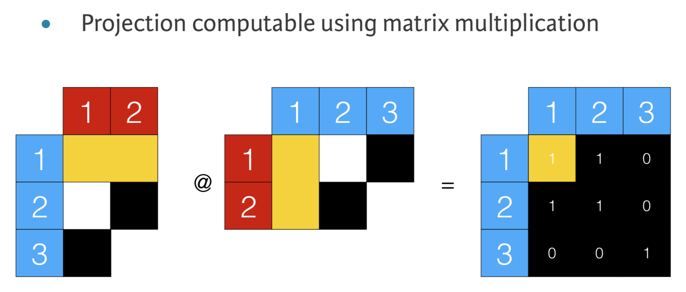

<h1 id="Network-Analysis">Network Analysis<a class="anchor-link" href="#Network-Analysis">&#182;</a></h1>

In&nbsp;[5]:

    

<pre>import networkx as nx
import os

base_url = os.path.expanduser(&#39;~/Documents/Data Science/DataCamp/Slides/17 Network Analysis/data/&#39;)

G_amrev = nx.read_edgelist(base_url + &#39;american-revolution.csv&#39;)
</pre>

In&nbsp;[&nbsp;]:

    

<pre>G_github = nx.read_edgelist(base_url + &#39;github.p&#39;)
G_uci = nx.read_edgelist(base_url + &#39;uci_forum.p&#39;)
</pre>

<h2 id="Introduction">Introduction<a class="anchor-link" href="#Introduction">&#182;</a></h2>
A network <strong>graph</strong> consists of <strong>nodes</strong> connected by <strong>edges</strong>.

<ul>
<li>Nodes and edges may each contain metadata.</li>
<li>
Networks model relationships between entities:

<ul>
<li>social</li>
<li>transportation  </li>
</ul>
</li>
<li>
Analyzing networks can provide insights into:

<ul>
<li>important entities: influencers in a social network</li>
<li>pathfinding: most efficient path</li>
<li>clustering: finding communities</li>
</ul>
</li>
</ul>

<h2 id="Types-of-Network-Graphs">Types of Network Graphs<a class="anchor-link" href="#Types-of-Network-Graphs">&#182;</a></h2><h3 id="Undirected-(Graph)">Undirected (Graph)<a class="anchor-link" href="#Undirected-(Graph)">&#182;</a></h3><ul>
<li>Facebook social graph</li>
<li>one bidirectional mapping between two entities</li>
</ul>
<h3 id="Directed-(DiGraph)">Directed (DiGraph)<a class="anchor-link" href="#Directed-(DiGraph)">&#182;</a></h3><ul>
<li>Twitter social graph</li>
<li>one unidirectional mapping between two entities</li>
</ul>
<h3 id="MultiGraph">MultiGraph<a class="anchor-link" href="#MultiGraph">&#182;</a></h3><ul>
<li>multiple bidirectional maps between two entities</li>
</ul>
<h3 id="MutliDiGraph">MutliDiGraph<a class="anchor-link" href="#MutliDiGraph">&#182;</a></h3><ul>
<li>trip records from one bike sharing station to another</li>
<li>multiple unidirectional edges between two entities</li>
</ul>
<h3 id="Self-loops">Self-loops<a class="anchor-link" href="#Self-loops">&#182;</a></h3><ul>
<li>nodes that connect back to themselves</li>
<li>a round-trip bike trip from a bike station back to the same bike station</li>
</ul>

<h2 id="Network-Analysis-Basics">Network Analysis Basics<a class="anchor-link" href="#Network-Analysis-Basics">&#182;</a></h2><h3 id="import">import<a class="anchor-link" href="#import">&#182;</a></h3>
<pre>import matplotlib.pyplot as plt
import networkx as nx
import nxviz as nv
</pre>

<h3 id="instantiate">instantiate<a class="anchor-link" href="#instantiate">&#182;</a></h3>
<pre># undirected graph
G = nx.Graph()

# directed graph
D = nx.DiGraph()

# Multi-edge graph
M = nx.MultiGraph()

# Multi-edge directed graph
MD = nx.MultDiiGraph()

# Barbell graph
BB = nx.barbell_graph(m1=5, m2=1)

# Erdos Renyi Graph
# n = number of nodes in the graph
# p = probability of an edge between any two nodes
G = nx.erdos_renyi_graph(n=20, p=0.2)
</pre>

<h3 id="fetch-graph-info">fetch graph info<a class="anchor-link" href="#fetch-graph-info">&#182;</a></h3>
<pre># returns a list of all nodes
G.nodes()

# returns node 1
G.nodes[1]

# returns a tuple containing node 1 name + dict of metadata
G.nodes(data=True)[1]

# returns an int count of nodes
len(G.nodes())

# returns metadata for all nodes
G.nodes(data=True)

# returns a list of all edges
G.edges()

# returns an int count of edges
len(G.edges())

# returns the graph&#39;s type
type(MD)
</pre>

<h3 id="adding-nodes">adding nodes<a class="anchor-link" href="#adding-nodes">&#182;</a></h3>
<pre># add multiple nodes from a list 
G.add_nodes_from([1, 2, 3])

# add dict to node 1&#39;s metadata
G.node[1][&#39;label&#39;] = &#39;blue&#39;

# add degree centrality score to each node&#39;s metadata dictionary
dcs = nx.degree_centrality(G)
for n in G.nodes():
    G.node[n][&#39;centrality&#39;] = dcs[n]
</pre>

<h3 id="adding-edges">adding edges<a class="anchor-link" href="#adding-edges">&#182;</a></h3>
<pre># add an edge between nodes 1 and 2
G.add_edge(1, 2)

# add multiple edges
G.add_edges_from([(1, 2), (1, 3)])
</pre>

<h3 id="fetching">fetching<a class="anchor-link" href="#fetching">&#182;</a></h3>
<pre># nodes
G.nodes()

# node 1
G.node[1]

# edges
G.edges()

# fetch metadata for all nodes
G.nodes(data=True)

# fetch metadata for all edges
G.edges(data=True)
# Returns a list of all nodes as tuple + dict -&gt; (1, 4, {&#39;date&#39; : datetime.date(2012, 11, 17)})
</pre>

<h3 id="fetching-nodes-&amp;-edges-that-meet-criteria">fetching nodes &amp; edges that meet criteria<a class="anchor-link" href="#fetching-nodes-&amp;-edges-that-meet-criteria">&#182;</a></h3>
<pre>noi = [n for n, d in T.nodes(data=True) if d[&#39;occupation&#39;] == &#39;scientist&#39;]

eoi = [(u, v) for u, v, d in T.edges(data=True) if d[&#39;date&#39;] &lt; date(2010, 1, 1)]
</pre>

<h3 id="List-comprehension-syntax:">List comprehension syntax:<a class="anchor-link" href="#List-comprehension-syntax:">&#182;</a></h3>
[ <i>output expression</i> <strong>for</strong> <i>iterator</i> <strong>in</strong> <i>iterable</i> <strong>if</strong> <i>predicate expression</i> ] 
<strong>OR</strong> 
[ <i>output expression</i> <strong>for</strong> <i>iterator</i> <strong>in</strong> <i>iterable</i>]

<h3 id="weighting-an-edge">weighting an edge<a class="anchor-link" href="#weighting-an-edge">&#182;</a></h3>
<pre># identify the edge by naming the nodes, set &#39;2&#39; as the value for the &#39;weight&#39; key in the metadata dictionary for the edge
T.edge[1][10][&#39;weight&#39;] = 2
</pre>

<h3 id="iterating-edges-with-metadata">iterating edges with metadata<a class="anchor-link" href="#iterating-edges-with-metadata">&#182;</a></h3>
<pre>for u, v, d in T.edges(data=True):
</pre>

where <code>(u, v)</code> are the nodes connected by the edge used to identify the edge and <code>d</code> is the edge's metadata dictionary.

<h3 id="self-loops">self-loops<a class="anchor-link" href="#self-loops">&#182;</a></h3>
<pre># get a count of all self-loops in a graph
G.number_of_selfloops()

# Define find_selfloop_nodes()
def find_selfloop_nodes(G):
    &quot;&quot;&quot;
    Finds all nodes that have self-loops in the graph G.
    &quot;&quot;&quot;
    nodes_in_selfloops = []

    # Iterate over all the edges of G
    for u, v in G.edges():

    # Check if node u and node v are the same
        if u == v:

            # Append node u to nodes_in_selfloops
            nodes_in_selfloops.append(u)

    return nodes_in_selfloops

# Check whether number of self loops equals the number of nodes in self loops
assert T.number_of_selfloops() == len(find_selfloop_nodes(T))
</pre>

<h3 id="checking-for-the-existence-of-an-edge-between-two-nodes">checking for the existence of an edge between two nodes<a class="anchor-link" href="#checking-for-the-existence-of-an-edge-between-two-nodes">&#182;</a></h3>
<pre>if G.has_edge(n1, n2):
</pre>

OR

<pre>if not G.has_edge(n1, n2):
</pre>

<h2 id="Visualizing-Networks">Visualizing Networks<a class="anchor-link" href="#Visualizing-Networks">&#182;</a></h2><h3 id="Basic">Basic<a class="anchor-link" href="#Basic">&#182;</a></h3>
<pre>nx.draw(G)
plt.show()
</pre>

<h3 id="Matrix-Plot">Matrix Plot<a class="anchor-link" href="#Matrix-Plot">&#182;</a></h3><ul>
<li>Undirected graphs are symmetrical since the edges are bidirectional, leads to a stripe along the diagonal from upper-left to lower-right</li>
<li>Directed graphs are most likely NOT symmetrical, since edges are unidirectional  </li>
<li>nodes are the rows and columns of the matrix, and cells are filled in according to whether an edge exists between the pairs of nodes</li>
</ul>

<pre># Import nxviz
import nxviz as nv

# Create the MatrixPlot object: m
m = nv.MatrixPlot(T)

# Draw m to the screen
m.draw()

# Display the plot
plt.show()

# Convert T to a matrix format: A
A = nx.to_numpy_matrix(T)

# Convert A back to the NetworkX form as a directed graph: T_conv
T_conv = nx.from_numpy_matrix(A, create_using=nx.DiGraph())

# Check that the `category` metadata field is lost from each node
for n, d in T_conv.nodes(data=True):
    assert &#39;category&#39; not in d.keys()
</pre>

<h3 id="Arc-Plot">Arc Plot<a class="anchor-link" href="#Arc-Plot">&#182;</a></h3><ul>
<li>nodes are ordered along one axis</li>
<li>edges are drawn using circular arcs from one node to another</li>
<li>if plot is ordered by a criteria or grouped by a location, an arc plot makes it possible to see relationships between connectivity and the sorted or grouped property</li>
</ul>

<pre># Import necessary modules
import matplotlib.pyplot as plt
from nxviz import ArcPlot

# Create the un-customized ArcPlot object: a
a = ArcPlot(T)

# Draw a to the screen
a.draw()

# Display the plot
plt.show()

# Create the customized ArcPlot object: a2
a2 = ArcPlot(T, node_order=&#39;category&#39;, node_color=&#39;category&#39;)

# Draw a2 to the screen
a2.draw()

# Display the plot
plt.show()
</pre>

<h3 id="Circos-Plot">Circos Plot<a class="anchor-link" href="#Circos-Plot">&#182;</a></h3><ul>
<li>transformation of the arc plot such that the two ends of the arc plot are joined together in a circle</li>
<li>aesthetic and compact version of the arc plot</li>
</ul>

<pre># import
import matplotlib.pyplot as plt
from nxviz import CircosPlot

# instantiate
c = CircosPlot(T)

# draw c to the screen
c.draw()

# display the plot
plt.show()
</pre>

<h2 id="Measuring-a-Node's-Importance">Measuring a Node's Importance<a class="anchor-link" href="#Measuring-a-Node's-Importance">&#182;</a></h2>
There are two ways to measure a node's importance in a network:

<ol>
<li>degree centrality - how many neighbors does a node have?</li>
<li>betweenness centrality - how many shortest paths pass through the node?</li>
</ol>

<h2 id="Degree-Centrality">Degree Centrality<a class="anchor-link" href="#Degree-Centrality">&#182;</a></h2>
<strong>neighbor node</strong>: connected node 
<strong>degree</strong>: the number of neighbors the node has 
<strong>degree centrality</strong>:  the number of neighbors the node has / count of all nodes in graph (-1 if self-loops aren't allowed)

<h3 id="fetch-a-list-of-a-node's-neighbors">fetch a list of a node's neighbors<a class="anchor-link" href="#fetch-a-list-of-a-node's-neighbors">&#182;</a></h3>
<pre># fetch a list of node 1&#39;s neighbors
G.neighbors(1)
</pre>

<h3 id="get-degree-centrality-for-each-node-in-a-graph">get degree centrality for each node in a graph<a class="anchor-link" href="#get-degree-centrality-for-each-node-in-a-graph">&#182;</a></h3>
<pre># print a dictionary with each node as a key and its degree centrality rating as its value
nx.degree_centrality(G)
</pre>

<h3 id="fetch-nodes-with-$n$-neighbors">fetch nodes with $n$ neighbors<a class="anchor-link" href="#fetch-nodes-with-$n$-neighbors">&#182;</a></h3>
<pre># Define nodes_with_m_nbrs()
def nodes_with_m_nbrs(G, m):
    &quot;&quot;&quot;
    Returns all nodes in graph G that have m neighbors.
    &quot;&quot;&quot;
    nodes = set()

    # Iterate over all nodes in G
    for n in G.nodes():

        # Check if the number of neighbors of n matches m
        if len(G.neighbors(n)) == m:

            # Add the node n to the set
            nodes.add(n)

    # Return the nodes with m neighbors
    return nodes

# Compute and print all nodes in T that have 6 neighbors
six_nbrs = nodes_with_m_nbrs(T, 6)
print(six_nbrs)
</pre>

<h3 id="compute-degree-&amp;-plot-hist-of-network">compute degree &amp; plot hist of network<a class="anchor-link" href="#compute-degree-&amp;-plot-hist-of-network">&#182;</a></h3>
<pre># Compute the degree of every node: degrees
degrees = [len(T.neighbors(n)) for n in T.nodes()]  

plt.hist(degrees)
</pre>

<h3 id="compute-degree_centrality-&amp;-plot-hist-of-network">compute degree_centrality &amp; plot hist of network<a class="anchor-link" href="#compute-degree_centrality-&amp;-plot-hist-of-network">&#182;</a></h3>
<pre># Compute the degree centrality of a network
deg_cent = nx.degree_centrality(G)  

plt.hist(list(deg_cent.values()))
</pre>

<h3 id="plot-scatter-of-degree-vs.-degree_centrality">plot scatter of degree vs. degree_centrality<a class="anchor-link" href="#plot-scatter-of-degree-vs.-degree_centrality">&#182;</a></h3>
<pre>plt.scatter(x=degrees, y=list(deg_cent.values()))
</pre>

<h3 id="find-nodes-with-highest-degree-centrality">find nodes with highest degree centrality<a class="anchor-link" href="#find-nodes-with-highest-degree-centrality">&#182;</a></h3>
<pre># Define find_nodes_with_highest_deg_cent()
def find_nodes_with_highest_deg_cent(G):

    # Compute the degree centrality of G: deg_cent
    deg_cent = nx.degree_centrality(G)

    # Compute the maximum degree centrality: max_dc
    max_dc = max(list(deg_cent.values()))

    nodes = set()

    # Iterate over the degree centrality dictionary
    for k, v in deg_cent.items():

        # Check if the current value has the maximum degree centrality
        if v == max_dc:

            # Add the current node to the set of nodes
            nodes.add(k)

    return nodes

# Find the node(s) that has the highest degree centrality in T: top_dc
top_dc = find_nodes_with_highest_deg_cent(T)
print(top_dc)

# Write the assertion statement
for node in top_dc:
    assert nx.degree_centrality(T)[node] == max(nx.degree_centrality(T).values())
</pre>

<h2 id="Betweenness-Centrality">Betweenness Centrality<a class="anchor-link" href="#Betweenness-Centrality">&#182;</a></h2>
<strong>all shortest paths</strong>: set of paths such that each path is the shortest path between a given pair of nodes

<strong>betweenness centrality</strong>:  number of <strong>shortest paths</strong> that pass through the node / all possible shortest paths

<ul>
<li>captures bottleneck nodes in a graph</li>
<li>identifies bridges between two networks (information transfer links)</li>
</ul>
<h3 id="fetch-betweenness-centrality-ratios">fetch betweenness centrality ratios<a class="anchor-link" href="#fetch-betweenness-centrality-ratios">&#182;</a></h3>
<pre>nx.betweenness_centrality(G)
</pre>

<h3 id="find-nodes-with-highest-betweenness-centrality">find nodes with highest betweenness centrality<a class="anchor-link" href="#find-nodes-with-highest-betweenness-centrality">&#182;</a></h3>
<pre># Define find_node_with_highest_bet_cent()
def find_node_with_highest_bet_cent(G):

    # Compute betweenness centrality: bet_cent
    bet_cent = nx.betweenness_centrality(G)

    # Compute maximum betweenness centrality: max_bc
    max_bc = max(list(bet_cent.values()))

    nodes = set()

    # Iterate over the betweenness centrality dictionary
    for k, v in bet_cent.items():

        # Check if the current value has the maximum betweenness centrality
        if v == max_bc:

            # Add the current node to the set of nodes
            nodes.add(k)

    return nodes

# Use that function to find the node(s) that has the highest betweenness centrality in the network: top_bc
top_bc = find_node_with_highest_bet_cent(T)

# Write an assertion statement that checks that the node(s) is/are correctly identified.
for node in top_bc:
    assert nx.betweenness_centrality(T)[node] == max(nx.betweenness_centrality(T).values())
</pre>

<h2 id="Path-Finding">Path Finding<a class="anchor-link" href="#Path-Finding">&#182;</a></h2><h3 id="Uses:">Uses:<a class="anchor-link" href="#Uses:">&#182;</a></h3><ul>
<li>optimization - finding the shortest transport path</li>
<li>modeling - spread of disease or information</li>
<li>also useful in determining a node's importance in a network  </li>
</ul>
<h3 id="Breadth-first-search-algorithm-(BFS)">Breadth-first search algorithm (BFS)<a class="anchor-link" href="#Breadth-first-search-algorithm-(BFS)">&#182;</a></h3>
Find the shortest path between start node and dest node by iterating through neighbors.

<pre>def path_exists(G, node1, node2):
    &quot;&quot;&quot;
    This function checks whether a path exists between two nodes (node1, node2) in graph G.
    &quot;&quot;&quot;
    visited_nodes = set()
    queue = [node1]

    for node in queue:  
        neighbors = G.neighbors(node)
        if node2 in neighbors:
            print(&#39;Path exists between nodes {0} and {1}&#39;.format(node1, node2))
            return True
            break

        else:
            visited_nodes.add(node)
            queue.extend([n for n in neighbors if n not in visited_nodes])

        # Check to see if the final element of the queue has been reached
        if node == queue[-1]:
            print(&#39;Path does not exist between nodes {0} and {1}&#39;.format(node1, node2))

            # Place the appropriate return statement
            return False
</pre>

<h2 id="Cliques">Cliques<a class="anchor-link" href="#Cliques">&#182;</a></h2>
<strong>Clique</strong>: all nodes are directly joined.
<strong>Triangle</strong>: smallest possible clique.

<ul>
<li>example: friend recommendation systems</li>
</ul>
<h3 id="Count-the-number-of-triangles-each-node-in-a-graph-in-involved-in">Count the number of triangles each node in a graph in involved in<a class="anchor-link" href="#Count-the-number-of-triangles-each-node-in-a-graph-in-involved-in">&#182;</a></h3>
<pre>nx.triangles(G)
</pre>

<h3 id="itertools.combinations-to-check-combinations-of-nodes">itertools.combinations to check combinations of nodes<a class="anchor-link" href="#itertools.combinations-to-check-combinations-of-nodes">&#182;</a></h3>
-iterates over every pair in the network (G.nodes(), 2) - the 2 tells it to look at pairs

<pre>from itertools import combinations

for n1, n2 in combinations(G.nodes(), 2):
    print(n1, n2)
</pre>

<h3 id="check-to-see-whether-given-node-is-a-member-of-a-triangle">check to see whether given node is a member of a triangle<a class="anchor-link" href="#check-to-see-whether-given-node-is-a-member-of-a-triangle">&#182;</a></h3>
<pre>from itertools import combinations

# Define is_in_triangle() 
def is_in_triangle(G, n):
    &quot;&quot;&quot;
    Checks whether a node `n` in graph `G` is in a triangle relationship or not. 

    Returns a boolean.
    &quot;&quot;&quot;
    in_triangle = False

    # Iterate over all possible triangle relationship combinations
    for n1, n2 in combinations(G.neighbors(n), 2):

        # Check if an edge exists between n1 and n2
        if G.has_edge(n1, n2):
            in_triangle = True
            break
    return in_triangle
</pre>

<h3 id="Find-all-nodes-in-a-triangle-relationship-with-a-given-node">Find all nodes in a triangle relationship with a given node<a class="anchor-link" href="#Find-all-nodes-in-a-triangle-relationship-with-a-given-node">&#182;</a></h3>
<pre>from itertools import combinations

# Write a function that identifies all nodes in a triangle relationship with a given node.
def nodes_in_triangle(G, n):
    &quot;&quot;&quot;
    Returns the nodes in a graph `G` that are involved in a triangle relationship with the node `n`.
    &quot;&quot;&quot;
    triangle_nodes = set([n])

    # Iterate over all possible triangle relationship combinations
    for n1, n2 in combinations(G.neighbors(n), 2):

        # Check if n1 and n2 have an edge between them
        if G.has_edge(n1, n2):

            # Add n1 to triangle_nodes
            triangle_nodes.add(n1)

            # Add n2 to triangle_nodes
            triangle_nodes.add(n2)

    return triangle_nodes

# Write the assertion statement
assert len(nodes_in_triangle(T, 1)) == 35
</pre>

<h3 id="Find-all-open-triangles-in-a-graph">Find all open triangles in a graph<a class="anchor-link" href="#Find-all-open-triangles-in-a-graph">&#182;</a></h3>
Think of a LinkedIn network recommender system - if A knows B &amp; C, it's probable that B &amp; C also know one another

<pre>from itertools import combinations

# Define node_in_open_triangle()
def node_in_open_triangle(G, n):
    &quot;&quot;&quot;
    Checks whether pairs of neighbors of node `n` in graph `G` are in an &#39;open triangle&#39; relationship with node `n`.
    &quot;&quot;&quot;
    in_open_triangle = False

    # Iterate over all possible triangle relationship combinations
    for n1, n2 in combinations(G.neighbors(n), 2):

        # Check if n1 and n2 do NOT have an edge between them
        if not G.has_edge(n1, n2):

            in_open_triangle = True

            break

    return in_open_triangle

# Compute the number of open triangles in T
num_open_triangles = 0

# Iterate over all the nodes in T
for n in T.nodes():

    # Check if the current node is in an open triangle
    if node_in_open_triangle(T, n):

        # Increment num_open_triangles
        num_open_triangles += 1

print(num_open_triangles)
</pre>

<strong>Maximal Clique</strong>: a clique that cannot be extended by adding an adjacent edge.  Useful when trying to find communities.

<strong>Community</strong>:

<code>find_cliques</code>: will find only maximal cliques

Given the barbell graph below, <code>find_cliques</code> will find 4 maximal cliques -- remember that edges are also cliques

<h3 id="find-all-maximal-cliques-of-size-=-n">find all maximal cliques of size = n<a class="anchor-link" href="#find-all-maximal-cliques-of-size-=-n">&#182;</a></h3>
<pre># Define maximal_cliques()
def maximal_cliques(G, size):
    &quot;&quot;&quot;
    Finds all maximal cliques in graph `G` that are of size `size`.
    &quot;&quot;&quot;
    mcs = []
    for clique in nx.find_cliques(G):
        if len(clique) == size:
            mcs.append(clique)
    return mcs

# Check that there are 33 maximal cliques of size 3 in the graph T
assert len(maximal_cliques(T, 3)) == 33
</pre>

<h2 id="Subgraphs">Subgraphs<a class="anchor-link" href="#Subgraphs">&#182;</a></h2>
Subgraphs allow you to view portions of a large graph for:

<ul>
<li>paths</li>
<li>communities / cliques</li>
<li>degrees of separation from a node</li>
</ul>

In&nbsp;[11]:

    

<pre>import matplotlib.pyplot as plt
import networkx as nx
import nxviz as nv

G = nx.erdos_renyi_graph(n=20, p=0.2)
G.nodes()
G.edges()
nodes = G.neighbors(8)
nodes
g_eight = G.subgraph(nodes)
g_eight.edges()

G
g_eight

nx.draw(g_eight, with_labels=True)
</pre>

Out[11]:

<pre>NodeView((0, 1, 2, 3, 4, 5, 6, 7, 8, 9, 10, 11, 12, 13, 14, 15, 16, 17, 18, 19))</pre>

Out[11]:

<pre>EdgeView([(0, 1), (0, 3), (0, 7), (0, 8), (0, 14), (1, 2), (2, 3), (2, 12), (2, 16), (3, 4), (3, 8), (3, 13), (3, 18), (4, 18), (5, 13), (6, 12), (6, 13), (7, 9), (7, 10), (7, 12), (7, 14), (8, 19), (9, 15), (10, 13), (10, 18), (11, 12), (11, 13), (11, 17), (11, 18), (12, 13), (13, 18), (15, 16), (16, 17)])</pre>

Out[11]:

<pre>&lt;dict_keyiterator at 0x1a1e40a188&gt;</pre>

Out[11]:

<pre>EdgeView([(0, 3)])</pre>

Out[11]:

<pre>&lt;networkx.classes.graph.Graph at 0x1a1e40bb38&gt;</pre>

Out[11]:

<pre>&lt;networkx.classes.graphviews.SubGraph at 0x1a1e40bd30&gt;</pre>

<img src="data:image/png;base64,iVBORw0KGgoAAAANSUhEUgAAAeEAAAFCCAYAAADGwmVOAAAABHNCSVQICAgIfAhkiAAAAAlwSFlzAAALEgAACxIB0t1+/AAAADl0RVh0U29mdHdhcmUAbWF0cGxvdGxpYiB2ZXJzaW9uIDIuMi4yLCBodHRwOi8vbWF0cGxvdGxpYi5vcmcvhp/UCwAADDNJREFUeJzt3V+IXulBx/HfO5OQzDQlGyWLqBAXa290I2ICRUQC3rhRhKxiLXixW6wQha4XqRAprBUhXuRO7YJUCCgKli3rhVm2/k0v9GJyockKYu3NIr2YQJdUNzNpknm9OJnuZHYm/3Zmfu/M+/nAQOY95z08JJDvOc95zvuOxuPxOADAjptpDwAAppUIA0CJCANAiQgDQIkIA0CJCANAiQgDQIkIA0CJCANAiQgDQIkIA0CJCANAiQgDQIkIA0CJCANAiQgDQIkIA0CJCANAyb72AOCJLS4mly4l164lN28mhw8nx48nL7+cHD3aHh3AYxuNx+NxexDwWBYWkgsXkjffHH5fXn5/29xcMh4nL7yQnD+fnDzZGSPAExBhdofXXkvOnUuWlobYbmY0GoJ88WJy9uzOjQ/gKZiOZvKtBvjWrUfvOx4P+507N/wuxMAEszCLybawkD9+5ZWcuHUrB5K8tG7zl5J8LMmhJD+X5JurG1ZDfPXqjg0V4EmJMJPtwoV8/507+XyST6/bdCXJ7yb5myTfSvJckk+t3WFpabiHDDCh3BNmci0uJseOfXcB1ueT/E+SS/c3n0uylORP7v/+zSQ/kOS/k/zw6jEOHkzeeceqaWAiuRJmcl269NDN4/s/a39PkrfX7jQaPfI4AC0izOS6du3Bx5DWOZ3kr5Ncy3BF/PtJRkkeWL61tJRcv76NgwR4eiLM5Lp586GbfzbJF5L8UpJjSX4oyUeT/OD6Hd99d+vHBrAFRJjJdfjwI3f5rSRfT7KYIcZ3k/zY+p2OHNnqkQFsCRFmch0/nhw8mLtJlpPcu/+znHz3tbcz3At+J8lvJHklyQPJnZtLnn9+J0cN8NisjmZy3V8d/XvLy/nCuk2vJvntJD+T5BsZpqFfTvIHSWbX7mh1NDDBRJjJ9uKLyRtvPPyjKjczGiVnziSvv7714wLYAiLMZFtYSE6deryPrFxvfj65ciU5cWLLhwWwFdwTZrKdPDl8GcP8/JO9b35+eJ8AAxPMFzgw+Va/hMG3KAF7jOlodo+rV4fPgr58eYjt0tL721a/T/j06eH7hF0BA7uACLP73LgxfBTl9evDB3EcOTI8hvTSS1ZBA7uKCANAiYVZAFAiwgBQIsIAUCLCAFAiwgBQIsIAUCLCAFAiwgBQIsIAUCLCAFAiwgBQIsIAUCLCAFAiwgBQIsIAUCLCAFAiwgBQIsIAUCLCAFAiwgBQIsIAUCLCAFAiwgBQIsIAUCLCAFAiwgBQIsIAUCLCAFAiwgBQIsIAUCLCAFAiwgBQIsIAUCLCAFAiwgBQIsIAUCLCAFAiwgBQIsIAUCLCAFAiwgBQIsIAUCLCAFAiwgBQIsIAUCLCAFAiwgBQIsIAUCLCAFAiwgBQIsIAUCLCAFAiwgBQIsIAUCLCAFAiwgBQIsIAUCLCAFAiwgBQIsIAUCLCAFAiwgBQIsIAUCLCAFAiwgBQIsIAUCLCAFAiwgBQIsIAUCLCAFAiwgBQIsIAUCLCAFAiwgBQIsIAUCLCAFAiwgBQIsIAUCLCAFAiwgBQIsIAUCLCAFAiwgBQIsIAUCLCAFAiwgBQIsIAUCLCAFAiwgBQIsIAUCLCAFAiwgBQIsIAUCLCAFAiwgBQIsIAUCLCAFAiwgBQIsIAUCLCAFAiwgBQIsIAUCLCAFAiwgBQIsIAUCLCAFAiwgBQIsIAUCLCAFAiwgBQIsIAUCLCAFAiwgBQIsIAUCLCAFAiwgBQIsIAUCLCAFAiwgBQIsIAUCLCAFAiwgBQIsIAUCLCAFAiwgBQIsIAUCLCAFAiwgBQIsIAUCLCAFAiwgBQIsIAUCLCAFAiwgBQIsIAUCLCAFAiwgBQIsIAUCLCAFAiwgBQIsIAUCLCAFAiwgBQIsIAUCLCAFAiwgBQIsIAUCLCAFAiwgBQIsIAUCLCAFAiwgBQIsIAUCLCAFAiwgBQIsIAUCLCAFAiwgBQIsIAUCLCAFAiwgBQIsIAUCLCAFAiwgBQIsIAUCLCAFAiwgBQIsIAUCLCAFAiwgBQIsIAUCLCAFAiwgBQIsIAUCLCAFAiwgBQIsIAUCLCAFAiwgBQIsIAUCLCAFAiwgBQIsIAUCLCAFAiwgBQIsIAUCLCAFAiwgBQIsIAUCLCAFAiwgBQIsIAUCLCAFAiwgBQIsIAUCLCAFAiwgBQIsIAUCLCAFAiwgBQIsIAUCLCAFAiwgBQIsIAUCLCAFAiwgBQIsIAUCLCAFAiwgBQIsIAUCLCAFAiwgBQIsIAUCLCAFAiwgBQIsIAUCLCAFAiwgBQIsIAUCLCAFAiwgBQIsIAUCLCAFAiwgBQIsIAULKvPYCJsLiYXLqUXLuW3LyZHD6cHD+evPxycvRoe3QA7FGj8Xg8bg+iZmEhuXAhefPN4ffl5fe3zc0l43HywgvJ+fPJyZOdMQKwZ01vhF97LTl3LllaGmK7mdFoCPLFi8nZszs3PgD2vOmcjl4N8K1bj953PB72O3du+F2IAdgi03clvLCQnDr1eAFeb34+uXIlOXFiy4cFwPSZvtXRFy4MU9DrfCvJmSQfSXIsyV9u9N6lpeH9ALAFputKeHExOXbswQVY930qyUqSP0vyb0l+Psm/JPnR9TsePJi8845V0wB8aNN1T/jSpQ1ffi/J60neTnIoyU8n+cUkf57kD9fvPBoNx/nc57ZrlAB8GLvosdPpivC1axteBf9XktkkH1/z2o8nubLRMZaWkuvXt2V4AHwID3vs9CtfSV59deIeO52uCN+8ueHL/5fk8LrXDif5300O83df/nI+87WvZf/+/dm3b1/27du36Z8ftu1p9tuuY8/OzmY0Gm3hXzbADnrUY6era4HeeCN5662Jeex0uiJ8eH1qB4eSfHvda99O8tFNDvNTp0/nny5ezN27d3P37t3cuXNnwz8/bNvD3nP79u28995723Lszbbdu3fvgWhPwsnDdp7MzMxM35pE2LN28WOn0xXh48eT11//wJT0x5PcTfL1JD9y/7V/zwaLspJkbi4f+cQn8txzz23nSHfcyspK7t2799Sx/zAnBbdv397RE447d+5kZmZmok44tvPYZjnY0xYWNgzwryX5hwxrfr4vye8k+fW1O6yG+OTJ6mOnVkff96tJRkm+lGF19OlYHb1XjcfjrKysVE44GsdeWVmZqJOC7T62WY4p8+KLwxTzupT9R5KPJTmQ5D+TnEryt0l+cu1Oo1Fy5sxwcVYyXVfCzz473JTf4B/si0k+neTZJN+b5LVsEODRKDl9WoB3udFolNnZ2czOzubAgQPt4Wy7zWY5duKkYHl5ecdPZtbOckzCScF2HnvqZzkWF4dFWBtcS679/3t0/+cbWRfh8Ti5fDm5caP2//p0RTgZVsW99dYHpi6+J8kbj3rv3NzwfthFZmZmMjMzk/3792dubq49nG212SzHXj3hWDvLsVtOHj7MeD5wwrHJY6erfjPJpSRLSX4iwwznB5QfO52+CJ88OayKe9yb+Kvm54f3+chKmFjTOsvRuD2ytLS0oycca2c5VgP9p0tL+ZXvfGfTv58vJvmjJP+a5J8zTE1/QPmx0+mLcPL+ajjfogTsYmtnOfa61VmOtVGe++Qnk69+9aHvm83wAUx/keE242c32undd7d8vI9relcwnD07fBnDmTPDYqv103Rzc8PrZ84M+wkwQM3qLMfBgwdz6NChPPPMMznwBPdx72a4J7yhI0e2YohPZTqvhFedODGsirtxY7gncP36cEZ05Ejy/PPJSy9ZhAUwqTZ57HQxyT8m+YUkc0n+PslfZZMv5pmbG/6/L5muR5QA2Ds2eez0RpJfzvB5DysZvhnvs0k+s9Exyo+dTveVMAC71yaPnR7NJp/9v94EPHbqShiA3WthITl16smedlk1Pz+s+Sk+9TK9C7MA2P1WHzudn3+y903IY6emowHY3XbxY6emowHYG65eHb5P+PLlIbarX1+YDOEdj4d7wOfP16+AV4kwAHvLLnrsVIQBoMTCLAAoEWEAKBFhACgRYQAoEWEAKBFhACgRYQAoEWEAKBFhACgRYQAoEWEAKBFhACgRYQAoEWEAKBFhACgRYQAoEWEAKBFhACgRYQAoEWEAKBFhACgRYQAoEWEAKBFhACgRYQAoEWEAKBFhACgRYQAoEWEAKBFhACgRYQAo+X9mhle0cOjPeAAAAABJRU5ErkJggg==
"
>

<h3 id="Draw-a-subgraph-given-a-list-of-nodes">Draw a subgraph given a list of nodes<a class="anchor-link" href="#Draw-a-subgraph-given-a-list-of-nodes">&#182;</a></h3>
<pre>nodes_of_interest = [29, 38, 42]

# Define get_nodes_and_nbrs()
def get_nodes_and_nbrs(G, nodes_of_interest):
    &quot;&quot;&quot;
    Returns a subgraph of the graph `G` with only the `nodes_of_interest` and their neighbors.
    &quot;&quot;&quot;
    nodes_to_draw = []

    # Iterate over the nodes of interest
    for n in nodes_of_interest:

        # Append the nodes of interest to nodes_to_draw
        nodes_to_draw.append(n)

        # Iterate over all the neighbors of node n
        for nbr in G.neighbors(n):

            # Append the neighbors of n to nodes_to_draw
            nodes_to_draw.append(nbr)

    return G.subgraph(nodes_to_draw)

# Extract the subgraph with the nodes of interest: T_draw
T_draw = get_nodes_and_nbrs(T, nodes_of_interest)

# Draw the subgraph to the screen
nx.draw(T_draw)
plt.show()
</pre>

<h3 id="Draw-a-subgraph-for-nodes-with-particular-metadata">Draw a subgraph for nodes with particular metadata<a class="anchor-link" href="#Draw-a-subgraph-for-nodes-with-particular-metadata">&#182;</a></h3>
<pre># Extract the nodes of interest: nodes
nodes = [n for n, d in T.nodes(data=True) if d[&#39;occupation&#39;] == &#39;celebrity&#39;]

# Create the set of nodes: nodeset
nodeset = set(nodes)

# Iterate over nodes
for n in nodes:

    # Compute the neighbors of n: nbrs
    nbrs = T.neighbors(n)

    # Compute the union of nodeset and nbrs: nodeset
    nodeset = nodeset.union(nbrs)

# Compute the subgraph using nodeset: T_sub
T_sub = T.subgraph(nodeset)

# Draw T_sub to the screen
nx.draw(T_sub)
plt.show()
</pre>

<h2 id="Case-Study:-Github-user-collaboration-network">Case Study: Github user collaboration network<a class="anchor-link" href="#Case-Study:-Github-user-collaboration-network">&#182;</a></h2><h3 id="degree-dist-plot">degree dist plot<a class="anchor-link" href="#degree-dist-plot">&#182;</a></h3>
<pre>h = nx.degree_centrality(G)

d=(list(h.values()))

plt.hist(d)
plt.show()
</pre>

<h3 id="betweenness-dist-plot">betweenness dist plot<a class="anchor-link" href="#betweenness-dist-plot">&#182;</a></h3>
<pre># Plot the degree distribution of the GitHub collaboration network
h = nx.betweenness_centrality(G)
b = (list(h.values()))

plt.hist(b)
plt.show()
</pre>

<h3 id="ArcPlot">ArcPlot<a class="anchor-link" href="#ArcPlot">&#182;</a></h3>
<pre># Import necessary modules
from nxviz.plots import ArcPlot
import matplotlib.pyplot as plt

# Iterate over all the nodes in G, including the metadata
for n, d in G.nodes(data=True):

    # Calculate the degree of each node: G.node[n][&#39;degree&#39;]
    G.node[n][&#39;degree&#39;] = nx.degree(G, n)

# Create the ArcPlot object: a
a = ArcPlot(graph=G, node_order=&#39;degree&#39;)

# Draw the ArcPlot to the screen
a.draw()
plt.show()
</pre>

<h3 id="CircosPlot">CircosPlot<a class="anchor-link" href="#CircosPlot">&#182;</a></h3>
<pre># Import necessary modules
from nxviz import CircosPlot
import matplotlib.pyplot as plt 

# Iterate over all the nodes, including the metadata
for n, d in G.nodes(data=True):

    # Calculate the degree of each node: G.node[n][&#39;degree&#39;]
    G.node[n][&#39;degree&#39;] = nx.degree(G, n)

# Create the CircosPlot object: c
c = CircosPlot(G, node_order=&#39;degree&#39;, node_grouping=&#39;grouping&#39;, node_color=&#39;grouping&#39;)

# Draw the CircosPlot object to the screen
c.draw()
plt.show()
</pre>

<h3 id="Cliques">Cliques<a class="anchor-link" href="#Cliques">&#182;</a></h3>
<strong>clique</strong>: group of nodes that are fully connected to one another.

<ul>
<li>simplest clique is an edge</li>
<li>simplest complex clique is a triangle</li>
</ul>

<strong>maximal clique</strong>: a clique that cannot be extended by adding another node in the graph

<h3 id="find-all-maximal-cliques">find all maximal cliques<a class="anchor-link" href="#find-all-maximal-cliques">&#182;</a></h3>
<pre>nx.find_cliques(g)
</pre>

<h3 id="find-length-of-each-maximal-clique">find length of each maximal clique<a class="anchor-link" href="#find-length-of-each-maximal-clique">&#182;</a></h3>
<pre>for clique in nx.find_cliques(G):
    print(len(clique))
</pre>

<h3 id="find-len-of-all-maximal-cliques">find len of all maximal cliques<a class="anchor-link" href="#find-len-of-all-maximal-cliques">&#182;</a></h3>
The key here is that <code>nx.find_cliques()</code> returns a generator, which needs to be converted to list before calling <code>list()</code>

<pre># Calculate the maximal cliques in G: cliques
cliques = nx.find_cliques(G)

# Count and print the number of maximal cliques in G
print(len(list(cliques)))
</pre>

<h3 id="create-subplot-of-largest-maximal-clique-&amp;-Circos-plot-it">create subplot of largest maximal clique &amp; Circos plot it<a class="anchor-link" href="#create-subplot-of-largest-maximal-clique-&amp;-Circos-plot-it">&#182;</a></h3>
<pre># Find the author(s) that are part of the largest maximal clique: largest_clique
largest_clique = sorted(nx.find_cliques(G), key=lambda x:len(x))[-1]

# Create the subgraph of the largest_clique: G_lc
G_lc = G.subgraph(largest_clique)

# Create the CircosPlot object: c
c = CircosPlot(G_lc)

# Draw the CircosPlot to the screen
c.draw()
plt.show()
</pre>

<h3 id="Tasks">Tasks<a class="anchor-link" href="#Tasks">&#182;</a></h3><h4 id="find-important-users">find important users<a class="anchor-link" href="#find-important-users">&#182;</a></h4>
Degree Centrality

<pre># Compute the degree centralities of G: deg_cent
deg_cent = nx.degree_centrality(G)

# Compute the maximum degree centrality: max_dc
max_dc = max(deg_cent.values())

# Find the user(s) that have collaborated the most: prolific_collaborators
prolific_collaborators = [n for n, dc in deg_cent.items() if n == max_dc]

# Print the most prolific collaborator(s)
print(prolific_collaborators)
</pre>

<h4 id="find-largest-communities">find largest communities<a class="anchor-link" href="#find-largest-communities">&#182;</a></h4>
Maximal Cliques

<pre># Import necessary modules
from nxviz import ArcPlot
import matplotlib.pyplot as plt

# Identify the largest maximal clique: largest_max_clique
largest_max_clique = set(sorted(nx.find_cliques(G), key=lambda x: len(x))[-1])

# Create a subgraph from the largest_max_clique: G_lmc
G_lmc = G.subgraph(largest_max_clique)

# Go out 1 degree of separation
for node in G_lmc.nodes():
    G_lmc.add_nodes_from(G.neighbors(node))
    G_lmc.add_edges_from(zip([node]*len(G.neighbors(node)), G.neighbors(node)))

# Record each node&#39;s degree centrality score
for n in G_lmc.nodes():
    G_lmc.node[n][&#39;degree centrality&#39;] = nx.degree_centrality(G_lmc)[n]

# Create the ArcPlot object: a
a = ArcPlot(G_lmc, node_order=&#39;degree centrality&#39;)

# Draw the ArcPlot to the screen
a.draw()
plt.show()
</pre>

<h4 id="Build-recommendation-systems">Build recommendation systems<a class="anchor-link" href="#Build-recommendation-systems">&#182;</a></h4>
Look for open triangles

<pre># Import necessary modules
from itertools import combinations
from collections import defaultdict

# Initialize the defaultdict: recommended
recommended = defaultdict(int)

# Iterate over all the nodes in G
for n, d in G.nodes(data=True):

    # Iterate over all possible triangle relationship combinations
    for n1, n2 in combinations(G.neighbors(n), 2):

        # Check whether n1 and n2 do not have an edge
        if not G.has_edge(n1, n2):

            # Increment recommended
            recommended[(n1, n2)] += 1

# Identify the top 10 pairs of users
all_counts = sorted(recommended.values())
top10_pairs = [pair for pair, count in recommended.items() if count &gt; all_counts[-10]]
print(top10_pairs)
</pre>

<strong>Network</strong> = Graph = (nodes, edges)

<ul>
<li>directed or undirected<ul>
<li>undirected = Facebook (bilateral)</li>
<li>directed = Twitter (unilateral)</li>
</ul>
</li>
</ul>

<pre># Create the CircosPlot object: c
c = CircosPlot(G, node_color=&#39;bipartite&#39;, node_grouping=&#39;bipartite&#39;, node_order=&#39;centrality&#39;)

# Draw c to the screen
c.draw()

# Display the plot
plt.show()
</pre>

<h2 id="bipartite-graph">bipartite graph<a class="anchor-link" href="#bipartite-graph">&#182;</a></h2>
<strong>bipartite graph</strong>: a graph that is partitioned into two sets; nodes are only connected across sets.

<ul>
<li>customers and the products they buy are two partitions in one graph.  Customers are connected by edges to the products they've purchased, but not connected to other customers.</li>
<li>it's customary to indicate which partition a node belongs to by adding a <code>bipartite=[partition]</code> entry in the node's dictionary</li>
</ul>
<h3 id="degree-centrality-in-bipartite-graphs">degree centrality in bipartite graphs<a class="anchor-link" href="#degree-centrality-in-bipartite-graphs">&#182;</a></h3>
Normally, degree centrality is:
$$\frac{\#\ of\ neighbors}{\#\ of\ possible\ neighbors}$$

In a bipartite graph, the denominator is the number of members in the other partition:
$$\frac{\#\ of\ neighbors}{\#\ of\ nodes\ in\ other\ partition}$$

<pre>cust_nodes = [n for n, d in G.nodes(data=True) if d[&#39;bipartite&#39;] == &#39;customers&#39;]

nx.bipartite.degree_centrality(G, cust_nodes)
</pre>

<h3 id="retrieving-nodes-from-a-partition">retrieving nodes from a partition<a class="anchor-link" href="#retrieving-nodes-from-a-partition">&#182;</a></h3>
<pre># Define get_nodes_from_partition()
def get_nodes_from_partition(G, partition):
    # Initialize an empty list for nodes to be returned
    nodes = []
    # Iterate over each node in the graph G
    for n in G.nodes():
        # Check that the node belongs to the particular partition
        if G.node[n][&#39;bipartite&#39;] == partition:
            # If so, append it to the list of nodes
            nodes.append(n)
    return nodes

# Print the number of nodes in the &#39;projects&#39; partition
print(len(get_nodes_from_partition(G, &#39;projects&#39;)))

# Print the number of nodes in the &#39;users&#39; partition
print(len(get_nodes_from_partition(G, &#39;users&#39;)))
</pre>

<h3 id="degree-centrality-distribution">degree centrality distribution<a class="anchor-link" href="#degree-centrality-distribution">&#182;</a></h3>
<strong>degree centrality distribution</strong> is the list of degree centrality scores for all nodes in the graph

<pre># Get the &#39;users&#39; nodes: user_nodes
user_nodes = get_nodes_from_partition(G, &#39;users&#39;)

# Compute the degree centralities: dcs
dcs = nx.degree_centrality(G)

# Get the degree centralities for user_nodes: user_dcs
user_dcs = [dcs[n] for n in user_nodes]

# Plot the degree distribution of users_dcs
plt.yscale(&#39;log&#39;)
plt.hist(user_dcs, bins=20)
plt.show()
</pre>

<h2 id="Bipartite-Graphs-and-Recommendation-Systems">Bipartite Graphs and Recommendation Systems<a class="anchor-link" href="#Bipartite-Graphs-and-Recommendation-Systems">&#182;</a></h2>
Unipartite - connect users to users
Bipartite - recommendation systems are based on set overlap between highly-similar nodes on one partition.

<ul>
<li>Users 1, 2 &amp; 3 are connected to Repo 2.  User 3 is also connected to Repo 1.  We can recommend Repo 1 to Users 1 &amp; 2.</li>
</ul>

<strong>Node sets</strong>

In&nbsp;[42]:

    

<pre># create the graph

G = nx.Graph()

G.add_node(&#39;user 1&#39;)

G.add_nodes_from([&#39;user 2&#39;, &#39;user 3&#39;])

for n in G.nodes():
    G.node[n][&#39;bipartite&#39;] = &#39;users&#39;

users = G.nodes(n for n in G.nodes() if G.node[n][&#39;bipartite&#39;] == &#39;users&#39;)

G.add_nodes_from([&#39;repo 1&#39;, &#39;repo 2&#39;, &#39;repo 3&#39;])
G.node[&#39;repo 1&#39;][&#39;bipartite&#39;] = &#39;repos&#39;
G.node[&#39;repo 2&#39;][&#39;bipartite&#39;] = &#39;repos&#39;
G.node[&#39;repo 3&#39;][&#39;bipartite&#39;] = &#39;repos&#39;

G.add_edges_from([(&#39;user 1&#39;, &#39;repo 3&#39;), (&#39;user 2&#39;, &#39;repo 3&#39;), (&#39;user 3&#39;, &#39;repo 3&#39;), (&#39;user 3&#39;, &#39;repo 2&#39;)])

G.nodes(data=True)
G.edges()
</pre>

Out[42]:

<pre>NodeDataView({&#39;user 1&#39;: {&#39;bipartite&#39;: &#39;users&#39;}, &#39;user 2&#39;: {&#39;bipartite&#39;: &#39;users&#39;}, &#39;user 3&#39;: {&#39;bipartite&#39;: &#39;users&#39;}, &#39;repo 1&#39;: {&#39;bipartite&#39;: &#39;repos&#39;}, &#39;repo 2&#39;: {&#39;bipartite&#39;: &#39;repos&#39;}, &#39;repo 3&#39;: {&#39;bipartite&#39;: &#39;repos&#39;}})</pre>

Out[42]:

<pre>EdgeView([(&#39;user 1&#39;, &#39;repo 3&#39;), (&#39;user 2&#39;, &#39;repo 3&#39;), (&#39;user 3&#39;, &#39;repo 3&#39;), (&#39;user 3&#39;, &#39;repo 2&#39;)])</pre>

In&nbsp;[53]:

    

<pre># fetch neighbors
user1_nbrs = list(G.neighbors(&#39;user 1&#39;))
user1_nbrs

user3_nbrs = list(G.neighbors(&#39;user 3&#39;))
user3_nbrs
</pre>

Out[53]:

<pre>[&#39;repo 3&#39;]</pre>

Out[53]:

<pre>[&#39;repo 3&#39;, &#39;repo 2&#39;]</pre>

In&nbsp;[55]:

    

<pre># find intersection of neighbors for users 1 &amp; 3
set(user1_nbrs).intersection(user3_nbrs)

# find difference of neighbors for users 1 &amp; 3 -- repos to recommend
# notice that order of args matters
set(user1_nbrs).difference(user3_nbrs)
set(user3_nbrs).difference(user1_nbrs)
</pre>

Out[55]:

<pre>{&#39;repo 3&#39;}</pre>

Out[55]:

<pre>set()</pre>

Out[55]:

<pre>{&#39;repo 2&#39;}</pre>

<h3 id="return-repos-shared-by-2-users">return repos shared by 2 users<a class="anchor-link" href="#return-repos-shared-by-2-users">&#182;</a></h3>
<pre>def shared_partition_nodes(G, node1, node2):
    # Check that the nodes belong to the same partition
    assert G.node[node1][&#39;bipartite&#39;] == G.node[node2][&#39;bipartite&#39;]

    # Get neighbors of node 1: nbrs1
    nbrs1 = G.neighbors(node1)
    # Get neighbors of node 2: nbrs2
    nbrs2 = G.neighbors(node2)

    # Compute the overlap using set intersections
    overlap = set(nbrs1).intersection(nbrs2)
    return overlap

# Print the number of shared repositories between users &#39;u7909&#39; and &#39;u2148&#39;
print(len(shared_partition_nodes(G, &#39;u7909&#39;, &#39;u2148&#39;)))
</pre>

<h3 id="user-similarity-metric">user similarity metric<a class="anchor-link" href="#user-similarity-metric">&#182;</a></h3>
Function to calculate the metric of similarity:

$$\frac{\#\ projects\ shared\ by\ 2\ users}{total\ \#\ of\ projects\ in\ other\ partitiion}$$

<pre>def user_similarity(G, user1, user2, proj_nodes):
    # Check that the nodes belong to the &#39;users&#39; partition
    assert G.node[user1][&#39;bipartite&#39;] == &#39;users&#39;
    assert G.node[user2][&#39;bipartite&#39;] == &#39;users&#39;

    # Get the set of nodes shared between the two users
    shared_nodes = shared_partition_nodes(G, user1, user2)

    # Return the fraction of nodes in the projects partition
    return len(shared_nodes) / len(proj_nodes)

# Compute the similarity score between users &#39;u4560&#39; and &#39;u1880&#39;
project_nodes = get_nodes_from_partition(G, &#39;projects&#39;)
similarity_score = user_similarity(G, &#39;u4560&#39;, &#39;u1880&#39;, project_nodes)

print(similarity_score)
</pre>

<h3 id="find-users-most-similar-to-a-given-user">find users most similar to a given user<a class="anchor-link" href="#find-users-most-similar-to-a-given-user">&#182;</a></h3>
<pre>from collections import defaultdict

def most_similar_users(G, user, user_nodes, proj_nodes):
    # Data checks
    assert G.node[user][&#39;bipartite&#39;] == &#39;users&#39;

    # Get other nodes from user partition
    user_nodes = set(user_nodes)
    user_nodes.remove(user)

    # Create the dictionary: similarities
    similarities = defaultdict(list)
    for n in user_nodes:
        similarity = user_similarity(G, user, n, proj_nodes)
        similarities[similarity].append(n)

    # Compute maximum similarity score: max_similarity
    max_similarity = max(similarities.keys())

    # Return list of users that share maximal similarity
    return similarities[max_similarity]

user_nodes = get_nodes_from_partition(G, &#39;users&#39;)
project_nodes = get_nodes_from_partition(G, &#39;projects&#39;)

print(most_similar_users(G, &#39;u4560&#39;, user_nodes, project_nodes))
</pre>

<h3 id="recommend-repositories">recommend repositories<a class="anchor-link" href="#recommend-repositories">&#182;</a></h3>
<pre>def recommend_repositories(G, from_user, to_user):
    # Get the set of repositories that from_user has contributed to
    from_repos = set(G.neighbors(from_user))
    # Get the set of repositories that to_user has contributed to
    to_repos = set(G.neighbors(to_user))

    # Identify repositories that the from_user is connected to that the to_user is not connected to
    return from_repos.difference(to_repos)

# Print the repositories to be recommended
print(recommend_repositories(G, &#39;u7909&#39;, &#39;u2148&#39;))
</pre>

<h2 id="Bipartite-Graph-Projections-&amp;-Matrix-Operations">Bipartite Graph Projections &amp; Matrix Operations<a class="anchor-link" href="#Bipartite-Graph-Projections-&amp;-Matrix-Operations">&#182;</a></h2>
<strong>projection</strong>: may be useful to investigate the relationships between nodes on one partition conditioned on the connections to the nodes in the other partition.

<ul>
<li>e.g., Which customers are relationed to one another, based on the products they've both bought?  If Cust 1 &amp; 2 bought Product 3, the customer projection would show Custs 1 &amp; 2 connected by a single edge.</li>
</ul>

<h3 id="importing-a-graph">importing a graph<a class="anchor-link" href="#importing-a-graph">&#182;</a></h3>
<pre># Read in the data: g
G = nx.read_edgelist(base_url + &#39;american-revolution.csv&#39;)

# Assign nodes to &#39;clubs&#39; or &#39;people&#39; partitions
for n, d in G.nodes(data=True):
    if &#39;.&#39; in n:
        G.node[n][&#39;bipartite&#39;] = &#39;people&#39;
    else:
        G.node[n][&#39;bipartite&#39;] = &#39;clubs&#39;

# Print the edges of the graph
print(G.edges())
</pre>

<h3 id="computing-projection">computing projection<a class="anchor-link" href="#computing-projection">&#182;</a></h3>
<pre># Prepare the nodelists needed for computing projections: people, clubs
people = [n for n in G.nodes() if G.node[n][&#39;bipartite&#39;] == &#39;people&#39;]
clubs = [n for n, d in G.nodes(data=True) if d[&#39;bipartite&#39;] == &#39;clubs&#39;]

# Compute the people and clubs projections: peopleG, clubsG
peopleG = nx.bipartite.projected_graph(G, people)
clubsG = nx.bipartite.projected_graph(G, clubs)
</pre>

<h3 id="list-comprehension-to-collect-nodes-in-a-partition">list comprehension to collect nodes in a partition<a class="anchor-link" href="#list-comprehension-to-collect-nodes-in-a-partition">&#182;</a></h3>
Without using <code>(data=True)</code> - find each node (<code>[n]</code>) then take the key of the node (<code>[bipartite]</code>)

<pre>people = [n for n in G.nodes() if G.node[n][&#39;bipartite&#39;] == &#39;people&#39;]
</pre>

Using <code>(data=True)</code> iterate the node and its dictionary as <code>n, d</code> then ask <code>d</code> for its key <code>bipartite</code>

<pre>clubs = [n for n, d in G.nodes(data=True) if d[&#39;bipartite&#39;] == &#39;clubs&#39;]
</pre>

<h3 id="plot-degree-centrality-on-projection">plot degree centrality on projection<a class="anchor-link" href="#plot-degree-centrality-on-projection">&#182;</a></h3>
<pre># Plot the degree centrality distribution of both node partitions from the original graph
plt.figure()
original_dc = nx.bipartite.degree_centrality(G, people)
plt.hist(list(original_dc.values()), alpha=0.5)
plt.yscale(&#39;log&#39;)
plt.title(&#39;Bipartite degree centrality&#39;)
plt.show()

# Plot the degree centrality distribution of the peopleG graph
plt.figure()  
people_dc = nx.degree_centrality(peopleG)
plt.hist(list(people_dc.values()))
plt.yscale(&#39;log&#39;)
plt.title(&#39;Degree centrality of people partition&#39;)
plt.show()

# Plot the degree centrality distribution of the clubsG graph
plt.figure() 
clubs_dc = nx.degree_centrality(clubsG)
plt.hist(list(clubs_dc.values()))
plt.yscale(&#39;log&#39;)
plt.title(&#39;Degree centrality of clubs partition&#39;)
plt.show()
</pre>

<h2 id="Bipartite-Adjacency-Graph-Matrices">Bipartite Adjacency Graph Matrices<a class="anchor-link" href="#Bipartite-Adjacency-Graph-Matrices">&#182;</a></h2>
Bipartite graphs represented in a matrix graph

<ul>
<li>one partition as rows</li>
<li>the other partition as columns</li>
</ul>

Are often asymmetric bc there are more ways to construct an asymmetic bipartite graph than a symmetric one.

<h3 id="bipartite-biadjacency-matrix">bipartite biadjacency matrix<a class="anchor-link" href="#bipartite-biadjacency-matrix">&#182;</a></h3>
<pre># returns a sparse matrix version of the graph
bipartite.biadjacency_matrix(G, row_order=x, [column_order=y])
</pre>

<h3 id="separate-nodes-into-partitions-&amp;-compute-adjacency-matrix">separate nodes into partitions &amp; compute adjacency matrix<a class="anchor-link" href="#separate-nodes-into-partitions-&amp;-compute-adjacency-matrix">&#182;</a></h3>
<pre>cust_nodes = [n for n in G.nodes() if G.node[n][&#39;bipartite&#39;] == &#39;customers&#39;]
prod_nodes = [n for n in G.nodes() if G.node[n][&#39;bipartite&#39;] == &#39;products&#39;]

mat = nx.bipartite.biadjacency_matrix(G, row_order=cust_nodes, column_order=prod_nodes)
</pre>

<h2 id="Matrix-projection">Matrix projection<a class="anchor-link" href="#Matrix-projection">&#182;</a></h2>
Projection is computable using matrix multiplication - matrix @ matrix.T = projection

<ul>
<li>multiply</li>
</ul>

sum_r_1 + sum_c_1 = r1_c1
(0+1) * (0+1) = 1

<ol>
<li>add the values of row 1 = sum_r_1 </li>
<li>add the values of column 1 = sum_c_1</li>
<li>r1_c1 of projection matrix = sum_r_1 * sum_c_1</li>
</ol>

row_1 * col_2 = r_1_c_2

<h3 id="compute-adjacency-matrix">compute adjacency matrix<a class="anchor-link" href="#compute-adjacency-matrix">&#182;</a></h3>
<pre># Get the list of people and list of clubs from the graph: people_nodes, clubs_nodes
people_nodes = get_nodes_from_partition(G, &#39;people&#39;)
clubs_nodes = get_nodes_from_partition(G, &#39;clubs&#39;)

# Compute the biadjacency matrix: bi_matrix
bi_matrix = nx.bipartite.biadjacency_matrix(G, row_order=people_nodes, column_order=clubs_nodes)

# Compute the user-user projection: user_matrix
user_matrix = bi_matrix @ bi_matrix.T

print(user_matrix)
</pre>

<h3 id="find-shared-membership:-Transposition">find shared membership: Transposition<a class="anchor-link" href="#find-shared-membership:-Transposition">&#182;</a></h3>
Find the names of people who were members of the most clubs

<pre># Find out the names of people who were members of the most number of clubs
diag = user_matrix.diagonal() 
indices = np.where(diag == diag.max())[0]  
print(&#39;Number of clubs: {0}&#39;.format(diag.max()))
print(&#39;People with the most memberships:&#39;)
for i in indices:
    print(&#39;- {0}&#39;.format(people_nodes[i]))

# Set the diagonal to zero and convert it to a coordinate matrix format
user_matrix.setdiag(0)
users_coo = user_matrix.tocoo()

# Find pairs of users who shared membership in the most number of clubs
indices = np.where(users_coo.data == users_coo.data.max())[0]
print(&#39;People with most shared memberships:&#39;)
for idx in indices:
    print(&#39;- {0}, {1}&#39;.format(people_nodes[users_coo.row[idx]], people_nodes[users_coo.col[idx]]))
</pre>

<h2 id="representing-network-data-in-pandas">representing network data in pandas<a class="anchor-link" href="#representing-network-data-in-pandas">&#182;</a></h2>
Create lists of tuples for each nodes and edges extracted from a graph, use each to create a DataFrame, save each list to .csv

<pre># start from a graph
G.nodes(data=True)

Out: [(0, {&#39;bipartite&#39;: 0}),
      (1, {&#39;bipartite&#39;: 0}),
      (2, {&#39;bipartite&#39;: 0}),
      ...]

# create empty list to hold to-be-created nodes
nodelist = []

# iterate through graph, creating tuples for node name + dictionary for metadata
for n, d in G.nodes(data=True):
    node_data = dict()
    node_data[&#39;node&#39;] = n   # make sure this is not a key in the node&#39;s metadata dictionary
    node_data.update(d)
    nodelist.append(node_data)

# create a new DataFrame object and add nodelist data
# keys become columns, values become rows
pd.DataFrame(nodelist)

# write to .csv
pd.DataFrame(nodelist).to_csv(&#39;my_file.csv&#39;)
</pre>

<h3 id="write-nodes-to-disk">write nodes to disk<a class="anchor-link" href="#write-nodes-to-disk">&#182;</a></h3>
<pre># Initialize a list to store each edge as a record: nodelist
nodelist = []
for n, d in G_people.nodes(data=True):
    # nodeinfo stores one &quot;record&quot; of data as a dict
    nodeinfo = {&#39;person&#39;: n} 

    # Update the nodeinfo dictionary 
    nodeinfo.update(d)

    # Append the nodeinfo to the node list
    nodelist.append(nodeinfo)

# Create a pandas DataFrame of the nodelist: node_df
node_df = pd.DataFrame(nodelist)
print(node_df.head())
</pre>

<h3 id="write-edges-to-disk">write edges to disk<a class="anchor-link" href="#write-edges-to-disk">&#182;</a></h3>
<pre># Initialize a list to store each edge as a record: edgelist
edgelist = []
for n1, n2, d in G_people.edges(data=True):
    # Initialize a dictionary that shows edge information: edgeinfo
    edgeinfo = {&#39;node1&#39;:n1, &#39;node2&#39;:n2}

    # Update the edgeinfo data with the edge metadata
    edgeinfo.update(d)

    # Append the edgeinfo to the edgelist
    edgelist.append(edgeinfo)

# Create a pandas DataFrame of the edgelist: edge_df
edge_df = pd.DataFrame(edgelist)
print(edge_df.head())
</pre>

<h2 id="graph-differences">graph differences<a class="anchor-link" href="#graph-differences">&#182;</a></h2>
Time series analysis - how some number changes as a function of time
Rate of change of things over a sliding window of time

<strong>evolving graphs</strong>

<ul>
<li>examples<ul>
<li>graphs that change over time - communication networks<ul>
<li>assumptions:<ul>
<li>edge changes over time; assume that nodes stay constant</li>
<li>both edges and nodes change over time
<strong>graph differences</strong>: if a node set doesn't change: changing only the edge set will result in a change in the graph            </li>
</ul>
</li>
</ul>
</li>
</ul>
</li>
</ul>

<h3 id="list-of-graphs">list of graphs<a class="anchor-link" href="#list-of-graphs">&#182;</a></h3>
<pre>months = range(4, 11)

# Initialize an empty list: Gs
Gs = [] 
for month in months:
    # Instantiate a new undirected graph: G
    G = nx.Graph()

    # Add in all nodes that have ever shown up to the graph
    G.add_nodes_from(data[&#39;sender&#39;])
    G.add_nodes_from(data[&#39;recipient&#39;])

    # Filter the DataFrame so that there&#39;s only the given month
    df_filtered = data[data[&#39;month&#39;] == month]

    # Add edges from filtered DataFrame
    G.add_edges_from(zip(df_filtered[&#39;sender&#39;], df_filtered[&#39;recipient&#39;]))

    # Append G to the list of graphs
    Gs.append(G)

print(len(Gs))
</pre>

<h3 id="graph-differences-over-time">graph differences over time<a class="anchor-link" href="#graph-differences-over-time">&#182;</a></h3>
<pre># Instantiate a list of graphs that show edges added: added
added = []
# Instantiate a list of graphs that show edges removed: removed
removed = []
# Here&#39;s the fractional change over time
fractional_changes = []
window = 1  
i = 0      

for i in range(len(Gs) - window):
    g1 = Gs[i]
    g2 = Gs[i + window]

    # Compute graph difference here
    added.append(nx.difference(g2, g1))   
    removed.append(nx.difference(g1, g2))

    # Compute change in graph size over time
    fractional_changes.append((len(g2.edges()) - len(g1.edges())) / len(g1.edges()))

# Print the fractional change
print(fractional_changes)
</pre>

<h3 id="plot-number-of-edge-changes-over-time">plot number of edge changes over time<a class="anchor-link" href="#plot-number-of-edge-changes-over-time">&#182;</a></h3>
<pre># Import matplotlib
import matplotlib.pyplot as plt

fig = plt.figure()
ax1 = fig.add_subplot(111)

# Plot the number of edges added over time
edges_added = [len(g.edges()) for g in added]
plot1 = ax1.plot(edges_added, label=&#39;added&#39;, color=&#39;orange&#39;)

# Plot the number of edges removed over time
edges_removed = [len(g.edges()) for g in removed]
plot2 = ax1.plot(edges_removed, label=&#39;removed&#39;, color=&#39;purple&#39;)

# Set yscale to logarithmic scale
ax1.set_yscale(&#39;log&#39;)  
ax1.legend()

# 2nd axes shares x-axis with 1st axes object
ax2 = ax1.twinx()

# Plot the fractional changes over time
plot3 = ax2.plot(fractional_changes, label=&#39;fractional change&#39;, color=&#39;green&#39;)

# Here, we create a single legend for both plots
lines1, labels1 = ax1.get_legend_handles_labels()
lines2, labels2 = ax2.get_legend_handles_labels()
ax2.legend(lines1 + lines2, labels1 + labels2, loc=0)
plt.axhline(0, color=&#39;green&#39;, linestyle=&#39;--&#39;)
plt.show()
</pre>

<h3 id="evolving-graph-statistics">evolving graph statistics<a class="anchor-link" href="#evolving-graph-statistics">&#182;</a></h3>
<strong>evolving graph statistics</strong>: graph summary stats, such as the number of nodes or edges, change over time (as in communication networks).  Degree (centrality &amp; betweenness) may also change over time.

<h2 id="cumulative-distribution-of-changes-in-degree-centrality-over-time">cumulative distribution of changes in degree centrality over time<a class="anchor-link" href="#cumulative-distribution-of-changes-in-degree-centrality-over-time">&#182;</a></h2>
Plotting the Empirical Cumulative Distribution Function ("ECDF") may be clearer than plotting with a histogram.

<h3 id="number-of-edges-over-time">number of edges over time<a class="anchor-link" href="#number-of-edges-over-time">&#182;</a></h3>
<pre>fig = plt.figure()

# Create a list of the number of edges per month
edge_sizes = [len(g.edges()) for g in Gs]

# Plot edge sizes over time
plt.plot(edge_sizes)
plt.xlabel(&#39;Time elapsed from first month (in months).&#39;) 
plt.ylabel(&#39;Number of edges&#39;)                           
plt.show()
</pre>

<h3 id="degree-centrality-over-time">degree centrality over time<a class="anchor-link" href="#degree-centrality-over-time">&#182;</a></h3>
<pre># Create a list of degree centrality scores month-by-month
cents = []
for G in Gs:
    cent = nx.degree_centrality(G)
    cents.append(cent)

# Plot ECDFs over time
fig = plt.figure()
for i in range(len(cents)):
    x, y = ECDF(cents[i].values()) 
    plt.plot(x, y, label=&#39;Month {0}&#39;.format(i+1)) 
plt.legend()   
plt.show()
</pre>

Summarizing evolving node statistics
how have purchasing patterns changed over time?
we've identified cust_1 as a node of interest ("NOI").  Now, we want to zoom in on that node and look at changes over time.

<pre>Gs = [...]
noi = &#39;customer1&#39;
degs=[]
for g in Gs:
    # get the degree of the node
    degs.append(len(g.neighbors(noi)))

plt.plot(degs)
plt.show()
</pre>

<h3 id="find-nodes-with-top-degree-centralities">find nodes with top degree centralities<a class="anchor-link" href="#find-nodes-with-top-degree-centralities">&#182;</a></h3>
<pre># Get the top 5 unique degree centrality scores: top_dcs
top_dcs = sorted(set(nx.degree_centrality(G).values()), reverse=True)[0:5]

# Create list of nodes that have the top 5 highest overall degree centralities
top_connected = []
for n, dc in nx.degree_centrality(G).items():
    if dc in top_dcs:
        top_connected.append(n)

# Print the number of nodes that share the top 5 degree centrality scores
print(len(top_connected))
</pre>

<h3 id="visualizing-connectivity">visualizing connectivity<a class="anchor-link" href="#visualizing-connectivity">&#182;</a></h3>
'defaultdict' is the preferred option here, as a regular Python dictionary would throw a KeyError if you try to get an item with a key that is not currently in the dictionary.

<h3 id="initializing-a-default-dict-of-lists">initializing a default dict of lists<a class="anchor-link" href="#initializing-a-default-dict-of-lists">&#182;</a></h3>
<code>d = defaultdict(list)</code>

<pre># Import necessary modules
import matplotlib.pyplot as plt
from collections import defaultdict

# Create a defaultdict in which the keys are nodes and the values are a list of connectivity scores over time
connectivity = defaultdict(list)
for n in top_connected:
    for g in Gs:
        connectivity[n].append(len(g.neighbors(n)))

# Plot the connectivity for each node
fig = plt.figure() 
for n, conn in connectivity.items(): 
    plt.plot(conn, label=n) 
plt.legend()  
plt.show()
</pre>

<strong>ANSWER</strong>: Notice how there seems to be two distinct clusters of nodes that behave slightly differently: nodes 32, 9 and 41 are one group, and the nodes 400, 105, and 103 are the other. There may be something interesting to investigate going forward!

<h2 id="Case-Study">Case Study<a class="anchor-link" href="#Case-Study">&#182;</a></h2>
College forum postings over 6 months
Bipartite graph of students and foums.  Edge exists where a student posts to a forum.

Assume we have a DataFrame of edgelists - customers and products and the edges between them.

<pre>G = nx.Graph()

# extract column labeled &#39;products&#39;, add nodes to graph with dictionary entry bipartite=&#39;products&#39;
G.add_nodes_from(df[&#39;products&#39;], bipartite=&#39;products&#39;)

# extract column labeled &#39;customers&#39;, add nodes to graph with dictionary entry bipartite=&#39;customers&#39;
G.add_nodes_from(df[&#39;customers&#39;]. bipartite=&#39;customers&#39;)

# nodes have been created, but no edges - use zip function to create edges
G.add_edges_from(zip(df[&#39;customers&#39;], df[&#39;products&#39;]))

# bipartite graph has been constructed in memory, now, we create the bipartite projections
# use list comprehension to create a container of nodes for each projection
cust_nodes = [n for n in G.nodes() if G.node[n][bipartite] == &#39;customers&#39;]
prod_nodes = [n for n in G.nodes() if G.node[n][bipartite] == &#39;products&#39;]

prodG = nx.bipartite.projected_graph(G, nodes=prod_nodes)
custG = nx.bipartite.projected_graph(G, nodes=cust_nodes)
</pre>

<h3 id="create-graph-from-a-DataFrame">create graph from a DataFrame<a class="anchor-link" href="#create-graph-from-a-DataFrame">&#182;</a></h3>
<pre>import networkx as nx

# Instantiate a new Graph: G
G = nx.Graph()

# Add nodes from each of the partitions
G.add_nodes_from(data[&#39;student&#39;], bipartite=&#39;student&#39;)
G.add_nodes_from(data[&#39;forum&#39;], bipartite=&#39;forum&#39;)

# Add in each edge along with the date the edge was created
for r, d in data.iterrows():
    G.add_edge(d[&#39;student&#39;], d[&#39;forum&#39;], date=d[&#39;date&#39;])
</pre>

<h3 id="visualize-the-degree-centrality-distribution-of-the-students-projection">visualize the degree centrality distribution of the students projection<a class="anchor-link" href="#visualize-the-degree-centrality-distribution-of-the-students-projection">&#182;</a></h3>
<pre># Get the student partition&#39;s nodes: student_nodes
student_nodes = [n for n, d in G.nodes(data=True) if d[&#39;bipartite&#39;] == &#39;student&#39;]

# Create the students nodes projection as a graph: G_students
G_students = nx.bipartite.projected_graph(G, nodes=student_nodes)

# Calculate the degree centrality using nx.degree_centrality: dcs
dcs = nx.degree_centrality(G_students)

# Plot the histogram of degree centrality values
plt.hist(list(dcs.values()))
plt.yscale(&#39;log&#39;)  
plt.show()
</pre>

<h3 id="visualize-the-degree-centrality-distirbution-of-the-forums-projection">visualize the degree centrality distirbution of the forums projection<a class="anchor-link" href="#visualize-the-degree-centrality-distirbution-of-the-forums-projection">&#182;</a></h3>
<pre># Get the forums partition&#39;s nodes: forum_nodes
forum_nodes = [n for n, d in G.nodes(data=True) if d[&#39;bipartite&#39;] == &#39;forum&#39;]

# Create the forum nodes projection as a graph: G_forum
G_forum = nx.bipartite.projected_graph(G, nodes=forum_nodes)

# Calculate the degree centrality using nx.degree_centrality: dcs
dcs = nx.degree_centrality(G_forum)

# Plot the histogram of degree centrality values
plt.hist(list(dcs.values()))
plt.yscale(&#39;log&#39;) 
plt.show()
</pre>

<h2 id="Time-based-Filtering">Time-based Filtering<a class="anchor-link" href="#Time-based-Filtering">&#182;</a></h2><h3 id="filtering-edges">filtering edges<a class="anchor-link" href="#filtering-edges">&#182;</a></h3>
example:
10 salespeople 0-9
10 customers 10-19
each edge has a dictionary with an entry for 'sale_count' : 14, the number of sales made by a salesperson to that customer.

We want to filter only those relationships with sales_count &gt; 10

<pre># d is used in the condition, but not returned.  Only (u, v) is returned
[(u, v) for u, v, d in G.edges(data=True) if d[&#39;sale_count&#39;] &gt;= 10]
</pre>

<h3 id="datetime">datetime<a class="anchor-link" href="#datetime">&#182;</a></h3>
<pre>from datetime import datetime, timedelta

year = 2011
month = 11
day1 = 10
day2 = 6

date1 = datetime(year, month, day1)
date2 = datetime(year, month, day2)
</pre>

<h3 id="time-filter-on-edges">time filter on edges<a class="anchor-link" href="#time-filter-on-edges">&#182;</a></h3>
<pre>import networkx as nx
from datetime import datetime

# Instantiate a new graph: G_sub
G_sub = nx.Graph()

# Add nodes from the original graph
G_sub.add_nodes_from(G.nodes(data=True))

# Add edges using a list comprehension with one conditional on the edge dates, that the date of the edge is earlier than 2004-05-16.
G_sub.add_edges_from([(u, v, d) for u, v, d in G.edges(data=True) if d[&#39;date&#39;] &lt; datetime(2004,5,16)])
</pre>

<h3 id="visualize-filtered-graph-using-nxviz">visualize filtered graph using nxviz<a class="anchor-link" href="#visualize-filtered-graph-using-nxviz">&#182;</a></h3>
<pre># Compute degree centrality scores of each node
dcs = nx.bipartite.degree_centrality(G, nodes=forum_nodes)
for n, d in G_sub.nodes(data=True):
    G_sub.node[n][&#39;dc&#39;] = dcs[n]

# Create the CircosPlot object: c
c = CircosPlot(G_sub, node_color=&#39;bipartite&#39;, node_grouping=&#39;bipartite&#39;, node_order=&#39;dc&#39;)

# Draw c to screen
c.draw()

# Display the plot
plt.show()
</pre>

<h2 id="Time-Series-Analysis">Time Series Analysis<a class="anchor-link" href="#Time-Series-Analysis">&#182;</a></h2><h3 id="datetime-math">datetime math<a class="anchor-link" href="#datetime-math">&#182;</a></h3>

In&nbsp;[22]:

    

<pre>from datetime import timedelta, datetime

day1 = datetime(2011, 11, 20, 0, 0)
days=4
td = timedelta(days)
day2 = day1 + td

day1
day2
</pre>

Out[22]:

<pre>datetime.datetime(2011, 11, 20, 0, 0)</pre>

Out[22]:

<pre>datetime.datetime(2011, 11, 24, 0, 0)</pre>

<h3 id="plot-number-of-posts-being-made-over-time">plot number of posts being made over time<a class="anchor-link" href="#plot-number-of-posts-being-made-over-time">&#182;</a></h3>
<pre># Define current day and timedelta of 2 days
curr_day = dayone
td = timedelta(days=2)

# Initialize an empty list of posts by day
n_posts = []
while curr_day &lt; lastday:
    if curr_day.day == 1:
        print(curr_day) 
    # Filter edges such that they are within the sliding time window: edges
    edges = [(u, v, d) for u, v, d in G.edges(data=True) if d[&#39;date&#39;] &gt;= curr_day and d[&#39;date&#39;] &lt; curr_day + td]

    # Append number of edges to the n_posts list
    n_posts.append(len(edges))

    # Increment the curr_day by the time delta
    curr_day += td

# Create the plot
plt.plot(n_posts)  
plt.xlabel(&#39;Days elapsed&#39;)
plt.ylabel(&#39;Number of posts&#39;)
plt.show()
</pre>

<h3 id="extract-mean-deg_cent-day-by-day-on-the-students-partition">extract mean deg_cent day-by-day on the students partition<a class="anchor-link" href="#extract-mean-deg_cent-day-by-day-on-the-students-partition">&#182;</a></h3>
<pre>from datetime import datetime, timedelta
import numpy as np
import networkx as nx
import matplotlib.pyplot as plt

# Initialize a new list: mean_dcs
mean_dcs = []
curr_day = dayone
td = timedelta(days=2)

while curr_day &lt; lastday:
    if curr_day.day == 1:
        print(curr_day)  
    # Instantiate a new graph containing a subset of edges: G_sub
    G_sub = nx.Graph()
    # Add nodes from G
    G_sub.add_nodes_from(G.nodes(data=True))
    # Add in edges that fulfill the criteria
    G_sub.add_edges_from([(u, v, d) for u, v, d in G.edges(data=True) if d[&#39;date&#39;] &gt;= curr_day and d[&#39;date&#39;] &lt; curr_day + td])

    # Get the students projection
    G_student_sub = nx.bipartite.projected_graph(G_sub, nodes=student_nodes)
    # Compute the degree centrality of the students projection
    dc = nx.degree_centrality(G_student_sub)
    # Append mean degree centrality to the list mean_dcs
    mean_dcs.append(np.mean(list(dc.values())))
    # Increment the time
    curr_day += td

plt.plot(mean_dcs)
plt.xlabel(&#39;Time elapsed&#39;)
plt.ylabel(&#39;Degree centrality.&#39;)
plt.show()
</pre>

<h3 id="dictionary-comprehension">dictionary comprehension<a class="anchor-link" href="#dictionary-comprehension">&#182;</a></h3>
format: {key: val for key, val in dict.items() if ...}

<h3 id="find-the-most-popular-forums-by-day">find the most popular forums by day<a class="anchor-link" href="#find-the-most-popular-forums-by-day">&#182;</a></h3>
<pre># Import necessary modules
from datetime import timedelta
import networkx as nx
import matplotlib.pyplot as plt

# Instantiate a list to hold the list of most popular forums by day: most_popular_forums
most_popular_forums = []
# Instantiate a list to hold the degree centrality scores of the most popular forums: highest_dcs
highest_dcs = []
curr_day = dayone  
td = timedelta(days=1)  

while curr_day &lt; lastday:  
    if curr_day.day == 1: 
        print(curr_day) 
    # Instantiate new graph: G_sub
    G_sub = nx.Graph()

    # Add in nodes from original graph G
    G_sub.add_nodes_from(G.nodes(data=True))

    # Add in edges from the original graph G that fulfill the criteria
    G_sub.add_edges_from([(u, v, d) for u, v, d in G.edges(data=True) if d[&#39;date&#39;] &gt;= curr_day and d[&#39;date&#39;] &lt; curr_day + td])

    # CODE CONTINUES ON NEXT EXERCISE
    curr_day += td
</pre>

<h3 id="part-2">part 2<a class="anchor-link" href="#part-2">&#182;</a></h3>
Continued from cell above.

<pre># Import necessary modules
from datetime import timedelta
import networkx as nx
import matplotlib.pyplot as plt

most_popular_forums = []
highest_dcs = []
curr_day = dayone 
td = timedelta(days=1)  

while curr_day &lt; lastday:  
    if curr_day.day == 1:  
        print(curr_day)  
    G_sub = nx.Graph()
    G_sub.add_nodes_from(G.nodes(data=True))   
    G_sub.add_edges_from([(u, v, d) for u, v, d in G.edges(data=True) if d[&#39;date&#39;] &gt;= curr_day and d[&#39;date&#39;] &lt; curr_day + td])

    # Get the degree centrality 
    dc = nx.bipartite.degree_centrality(G_sub, forum_nodes)
    # Filter the dictionary such that there&#39;s only forum degree centralities
    forum_dcs = {n:dc for n, dc in dc.items() if n in forum_nodes}
    # Identify the most popular forum(s) 
    most_popular_forum = [n for n, dc in forum_dcs.items() if dc == max(forum_dcs.values()) and dc != 0] 
    most_popular_forums.append(most_popular_forum) 
    # Store the highest dc values in highest_dcs
    highest_dcs.append(max(forum_dcs.values()))

    curr_day += td  

plt.figure(1) 
plt.plot([len(forums) for forums in most_popular_forums], color=&#39;blue&#39;, label=&#39;Forums&#39;)
plt.ylabel(&#39;Number of Most Popular Forums&#39;)
plt.show()

plt.figure(2)
plt.plot(highest_dcs, color=&#39;orange&#39;, label=&#39;DC Score&#39;)
plt.ylabel(&#39;Top Degree Centrality Score&#39;)
plt.show()
</pre>

 

